## MDW 6 Demo
#### Setup Eclipse with MDW Plug-In

- Make sure Java Runtime 1.8.x is installed on your computer:
  http://www.oracle.com/technetwork/java/javase/downloads
  
- Set JAVA_HOME to JDK 1.8.X:                                                                                                                                          
  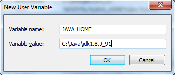
                                                                                                                                                                        
- Set the path:  %PATH%;%JAVA_HOME%\bin;

- Install Eclipse Neon (4.6.x) for JavaEE Developers:  https://www.eclipse.org/downloads

- Launch Eclipse:
  Here’s an example command line that includes appropriate JVM memory settings for running and debugging:
  C:\eclipse_4.6.2\eclipse.exe -vm C:\Java\jdk1.8.0_91\bin\javaw.exe -vmargs -Xms512m -Xmx1024m
  
- Install the latest version of the MDW Plug-In via Eclipse Software Updates (Help > Install New Software > Add > http://lxdenvmtc143.dev.qintra.com:6101/MdwPlugin > Install):

  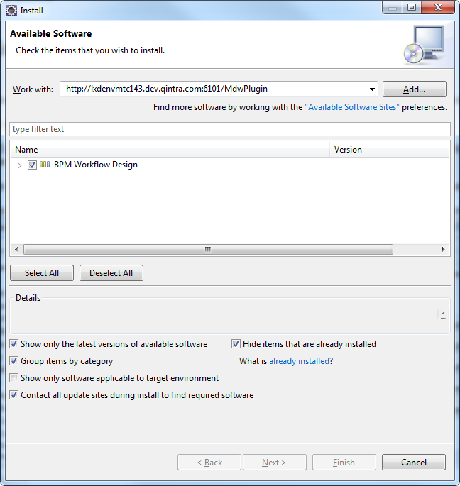 

- Configure your Eclipse with Java 1.8.x installed JRE available in your workspace (Window > Preferences > Java > Installed JREs > Add):
  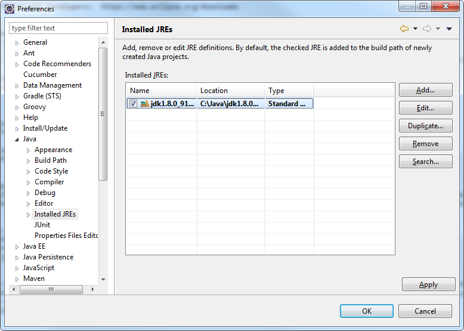 

### Optional Plug-Ins:
- Groovy Eclipse Plug-In (Groovy script syntax highlighting, auto-complete, etc.):
  http://dist.springsource.org/snapshot/GRECLIPSE/e4.6
  
- Yaml:
  http://dadacoalition.org/yedit
  
- Quantum DB Plug-In (Database querying):
  http://quantum.sourceforge.net/update-site
  
### Supported Java Container (Apache Tomcat 7 or 8)  
You can perform many cloud development activities using a remote workflow project.  However, there are certain advantages to being able to deploy locally.  To be able to develop locally you need an Apache Tomcat: https://tomcat.apache.org.

### MDW Database:
- MDW saves the workflow assets you create on your local file system until you commit them to a version control repository such as Git.  Runtime data is stored in a MySQL or Oracle database.
  Supported versions are listed in the MDW Compatibility Matrix.  Generally for cloud development you'll point to a pre-existing central database.  If you want to host your own database, 
  you'll need to configure an instance of MySQL with the MDW db schema.  The SQL scripts for installing the MDW schema are available here:  
  http://cshare.ad.qintra.com/sites/MDW/Developer%20Resources/MDW%20Database.

## mdw-demo Project

#### Add Git Repository:
- The mdw-demo workflow project is hosted in the MDW AppFog Git Repository.  If you prefer to use command line Git, clone the repository from 
  https://github.com/mdw-dev/mdw-demo.git. 
  
### Clone mdw-demo project into your workspace:
- Access the Git Repositories view by selecting Window > Show View > Other > Git > Git Repositories:
- Copy the repository URL into your clipboard: https://github.com/mdw-dev/mdw-demo.git
- Right-click in Git Repositories view and select Paste Repository Path or URI.
- Enter mdw for the User and ldap_0123 for the Password:

  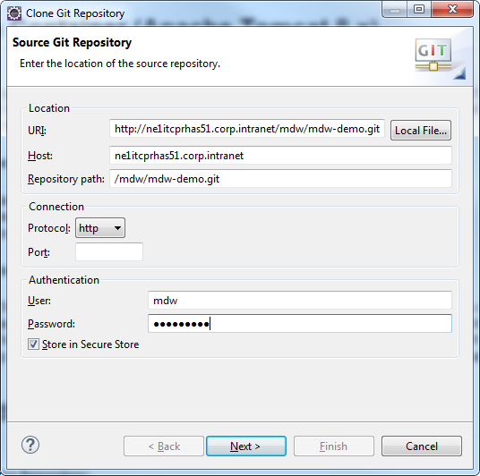
  
- Click Next and make sure the master branch is selected:

  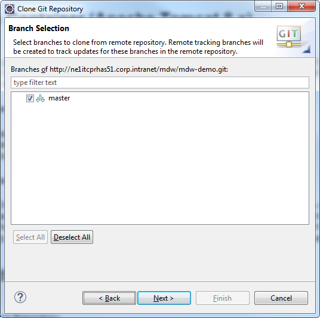
  
- Click Next again and point to your workspace/mdw-demo for the Destination Directory.  
- Check "Import all existing Eclipse projects after clone finishes".  Then click Finish.

  
  
- Edit **mdw-demo/config/mdw.properties** file to suit your environment. Make sure the mdw.asset.location is set to your mdw-demo/assets location and mdw.git.local.path is set your mdw-demo project 
  path on your machine. Here is an example: 
	
    	mdw.asset.location=C:/workspaces/mdw6Demo/mdw-demo/assets
    	mdw.git.local.path=C:/workspaces/mdw6Demo/mdw-demo

### MDW Designer Perspective:
- To best view the workflow assets, switch to Designer Perspective (Window > Perspective > Open Perspective > Other > MDW Designer).
- In Process Explorer view expand the mdw-demo project to see the included workflow packages.
- It will make more sense after you have gone through creating your first workflow process. But for now, you can take a look at the demo intro 
  process to get a feel for it by opening the com.centurylink.mdw.demo.intro package and double click the HandleOrder process in the mdw-demo 
  project and you will be able to view the demo Process design model.
 
#### Build and Update mdw-demo project:
Before you can deploy your demo project to your server, you will need to do a maven build.  You only need to do this once to generate the required dependent jar files.
- On your eclipse, switch to Java perspective.
- Right click on the pom.xml file in your mdw-demo project, choose Run As and Maven build. If this is the first time doing the Maven build, you may see the Maven Edit configuration and launch 
  screen come up. All you need to enter on the screen is package in the Goals:, click Apply and Run.
  
  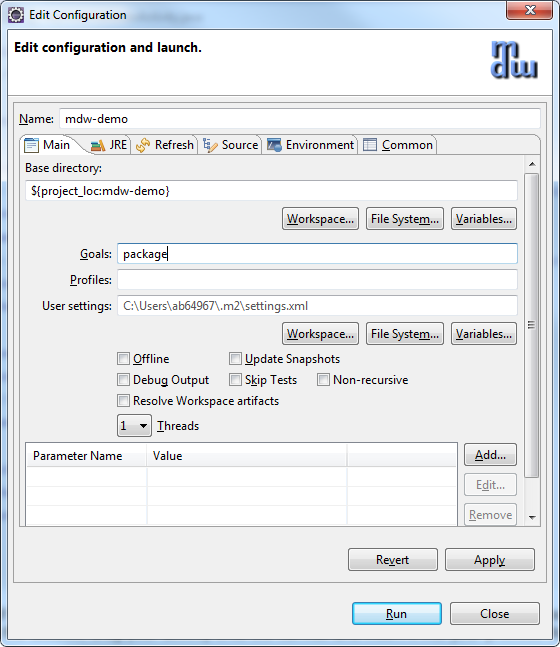
  
- If you get errors from the Maven build, do the Maven clean and then Maven build.
- Next you will need to update your mdw-demo project from Java perspective. 
- Right click the mdw-demo project, select Maven then Update Project... to update the project with the latest code base from the Maven repository.

### Tomcat Setup & Running a Process                              

#### Create Tomcat Server:
- To execute a workflow process you need a server running with MDW deployed.  For debugging in Eclipse the easiest way to set this up is through a Web Tools Platform server instance. 
  From the menu select File > New > Other > Server > Server.  Click Next and select Apache > Tomcat 8.0 (MDW) from the options.  To be able to debug your Dynamic Java it's important that 
  you select Tomcat 8.0 (MDW) instead of the standard Tomcat 8.0 Server.  The server name is arbitrary, so you can give it something friendlier than the default.
  
  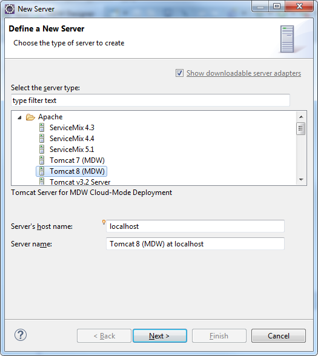
  
- If you've not previously used a Tomcat 8 runtime in Eclipse, clicking Add takes you to a page where you specify your Tomcat location.   Make sure to select a JDK to compile the code and 
  that the selected JDK is Java 1.8.x
  
  
  
- The final page of the New Server wizard is where you designate your workflow project to be deployed on the server.  After that, click Finish to create the server instance.
- If the Servers view is not visible in your current perspective, from the menu select Window > Show View > Other > Server > Servers.  You should see your Tomcat 8 server in this view.  
  You can double-click the server to edit its configuration.  Expand the Timeouts section, change the start timeout value to 3600 seconds, and hit Ctrl-S to save your changes.  Then close
  the editor.
  
  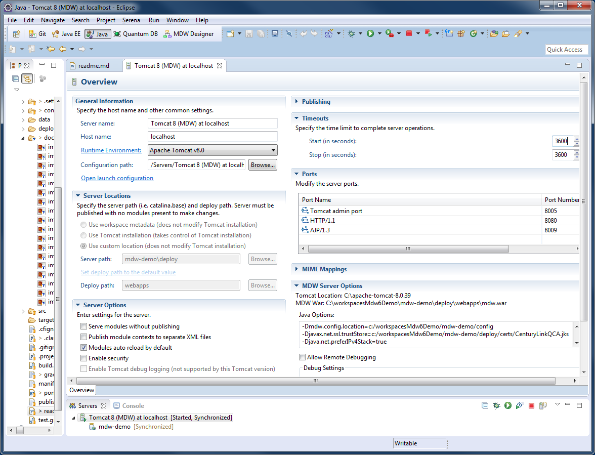
 
- Before you start the server, you will need to add your mdw-demo project to your server instance. Right click the server instance, select Add and Remove… and select the mdw-demo from the 
  left pane and click the Add to move it to the right pane.
  
  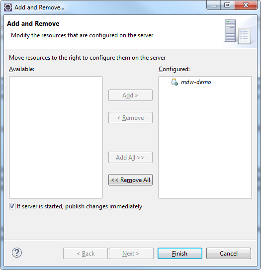
                          
#### Run Tomcat:
- Now that you've created the WTP server instance, the Servers view gives you a handy way to start and stop Tomcat.  And output is directed to the Eclipse Console view, where you can click on stack 
  traces to open associated source code (including MDW Framework code and Dynamic Java).  Start your server in debug mode by right-clicking on it and selecting Debug (or use the icon in the Servers view
  toolbar).
- The first time you start your server Tomcat explodes the mdw.war file in your deploy/webapps directory and caches the deployable content.  This can sometimes take a minute.  With the server running 
  you should see MDW output in the Eclipse Console view.  You can safely ignore any Dynamic Java compilation errors unless they pertain to the custom activity you created in  

#### Deploy:
When you upgrade to a new MDW build version in Eclipse, Designer automatically downloads the corresponding mdw.war file into your deploy/webapps directory.  If at any time you want to clean out the MDW deployment and start fresh, you can delete mdw.war and the exploded mdw directory (and for a very thorough cleansing you can even delete the Tomcat cache under deploy/work/Catalina/localhost/mdw).  Then you can deploy from scratch from Package Explorer view by right-clicking on your workflow project and selecting MDW Update > Update Framework Libraries.
- Make sure your project is added to your Java Build Path/Source. You will need to do this from a Java or Resource perspective.
- You can confirm that MDW was successfully deployed by accessing MDWHub in your browser:
  http://localhost:8080/mdw
 
#### Open Process Launch Dialog:
- Right-click on your process that is under your workflow package in Process Explorer view and Select Run. You can also right-click on your Designer and Select Run.  Designer will present 
  the launch dialog and open a connection to the server to confirm that it's running (required for launching a process).
- On the Process tab in the launch dialog, select **"Monitor Runtime Log"** and **"Process Instance Live View"** to get a feel for how you can watch your process flow in real time.

  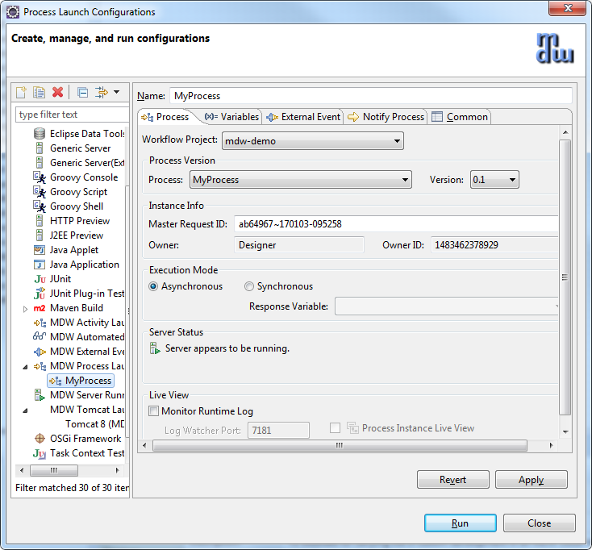

#### Populate Input Variable:
- Select the Variables tab in the launch dialog, and populate the request variable with the following content.
  <order>
  	<orderId>N12345678</orderId>
  </order>
  
  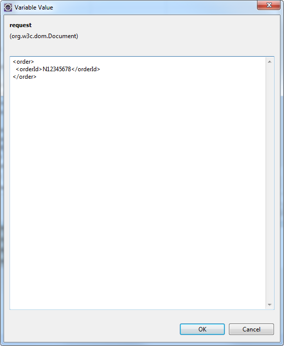
 
#### Launch and View Instance:
- Click Run on the launch dialog to run an instance of your process.  In the Live View you should see the new instance progress down the happy path with the Validator Order outcome equal to 
  'true'.  For processes not displayed in Live View, you can open an instance manually by right-clicking on your process in Process Explorer view and selecting View Instances.  The latest 
  instance will appear at the top of the Process Instances list, and you can double-click to open its runtime view.
- In Designer Perspective when a process instance is visible, a legend appears showing what the borders surrounding the activities mean.  To inspect the runtime variable values for the 
  instance, click the Values property tab.  
  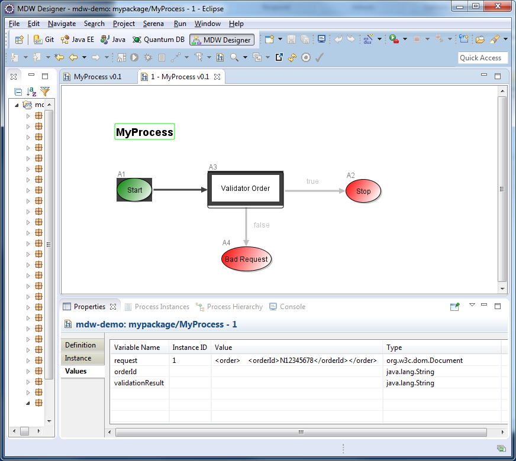
 
Congratulations! You've completed your mdw-demo project successfully.
