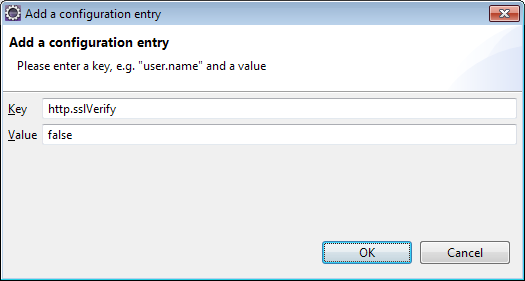
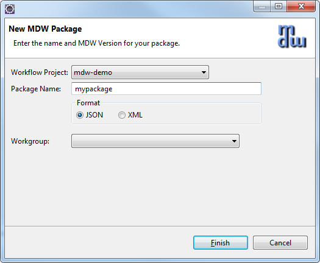
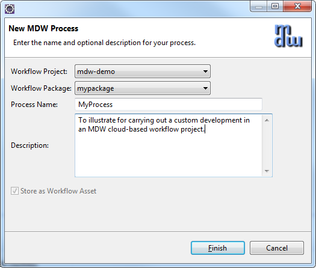
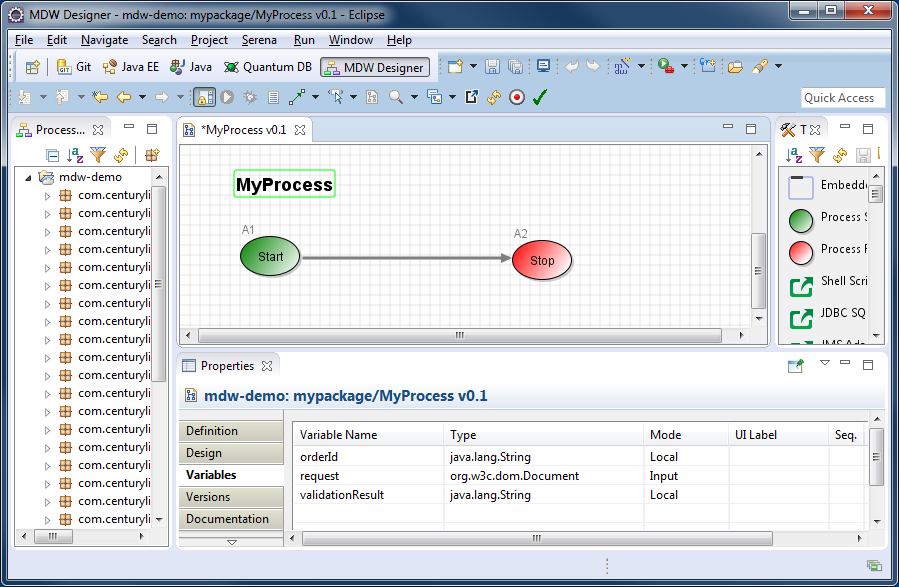
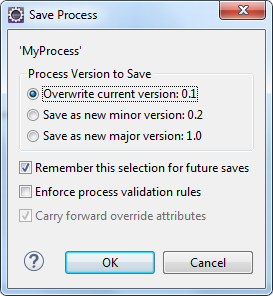
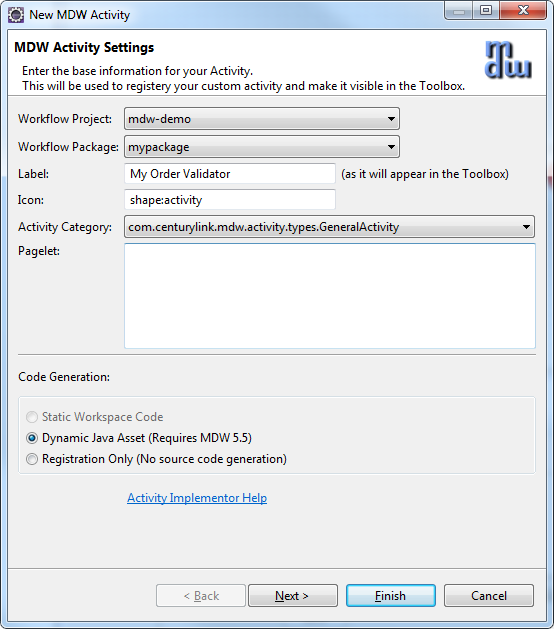
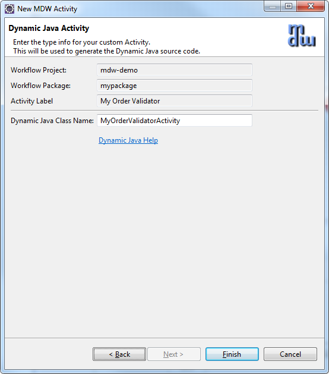
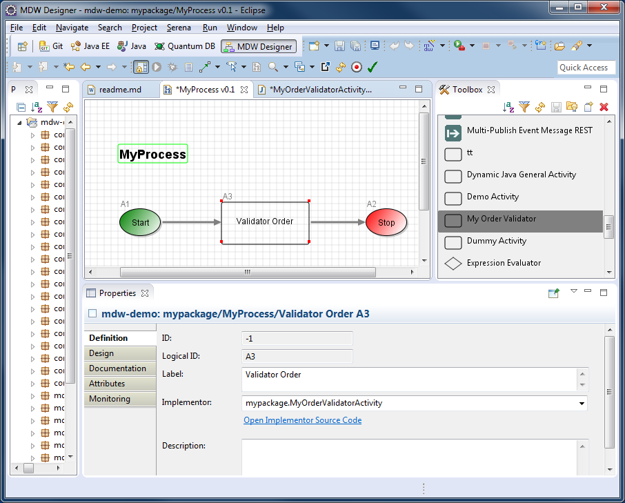
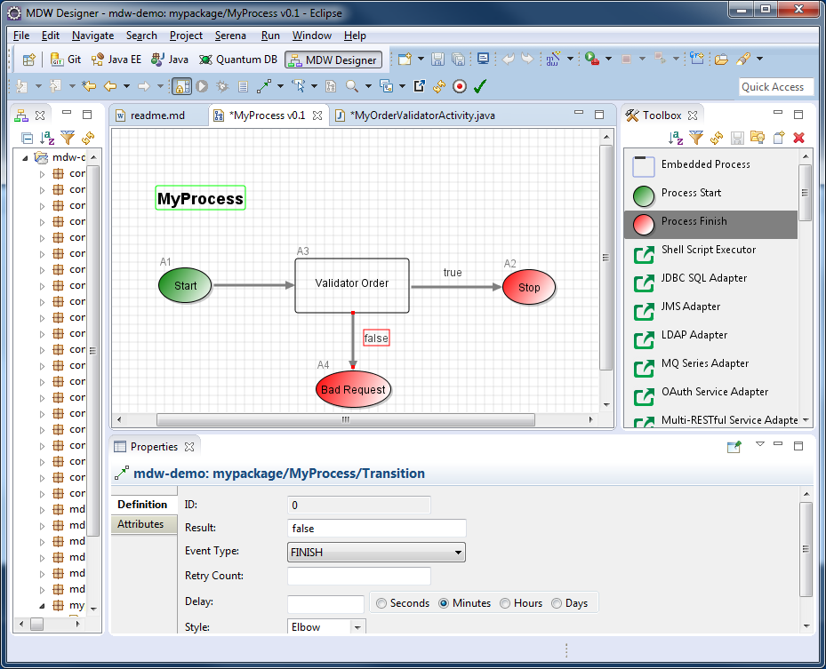
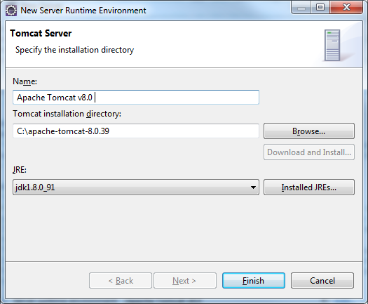

## MDW 6 Demo
#### Setup Eclipse with MDW Plug-In

- Make sure Java Runtime 1.8.x is installed on your computer:
  http://www.oracle.com/technetwork/java/javase/downloads
  
- Set JAVA_HOME to JDK 1.8.X:                                                                                                                                          
  
                                                                                                                                                                        
- Set the path:  %PATH%;%JAVA_HOME%\bin;

- Install Eclipse Neon (4.6.x) for JavaEE Developers:  https://www.eclipse.org/downloads

- Launch Eclipse:
  Here’s an example command line that includes appropriate JVM memory settings for running and debugging:
  C:\eclipse_4.6.2\eclipse.exe -vm C:\Java\jdk1.8.0_91\bin\javaw.exe -vmargs -Xms512m -Xmx1024m
  
- Install the latest version of the MDW Plug-In via Eclipse Software Updates (Help > Install New Software > Add > http://lxdenvmtc143.dev.qintra.com:6101/MdwPlugin > Install):

   

- Configure your Eclipse with Java 1.8.x installed JRE available in your workspace (Window > Preferences > Java > Installed JREs > Add):
   

### Optional Plug-Ins:
- Groovy Eclipse Plug-In (Groovy script syntax highlighting, auto-complete, etc.):
  http://dist.springsource.org/snapshot/GRECLIPSE/e4.6
  
- Yaml:
  http://dadacoalition.org/yedit
  
- Quantum DB Plug-In (Database querying):
  http://quantum.sourceforge.net/update-site
  
### Supported Java Container (Apache Tomcat 7 or 8)  
You can perform many cloud development activities using a remote workflow project.  However, there are certain advantages to being able to deploy locally.  To be able to develop locally you need an Apache Tomcat: https://tomcat.apache.org.

### MDW Database:
- MDW saves the workflow assets you create on your local file system until you commit them to a version control repository such as Git.  Runtime data is stored in a MySQL or Oracle database.
  Supported versions are listed in the MDW Compatibility Matrix.  Generally for cloud development you'll point to a pre-existing central database.  If you want to host your own database, 
  you'll need to configure an instance of MySQL with the MDW db schema.  The SQL scripts for installing the MDW schema are available here:  
  http://cshare.ad.qintra.com/sites/MDW/Developer%20Resources/MDW%20Database.

## mdw-demo Project

#### Add Git Repository:
- The mdw-demo workflow project is hosted in the MDW AppFog Git Repository.  If you prefer to use command line Git, clone the repository from 
  https://8.22.8.164/mdw/mdw-demo.git using credentials mdw/ldap_0123.
 
- Disable Git SSL Verification in Eclipse:
  Our SSL certificate is self-signed and is not trusted by Git.  Therefore, the first step is to disable (at least temporarily) SSL verification.  From the Eclipse menu, select Window > Preferences > 
 Team > Git > Configuration > Add Entry… 
 
  
  
### Clone mdw-demo project into your workspace:
- Access the Git Repositories view by selecting Window > Show View > Other > Git > Git Repositories:
- Copy the repository URL into your clipboard: https://8.22.8.164/mdw/mdw-demo.git
- Right-click in Git Repositories view and select Paste Repository Path or URI.
- Enter mdw for the User and ldap_0123 for the Password:

  
  
- Click Next and make sure the master branch is selected:

  
  
- Click Next again and point to your workspace/mdw-demo for the Destination Directory.  
- Check "Import all existing Eclipse projects after clone finishes".  Then click Finish.

  
  
- Edit **mdw-demo/config/mdw.properties** file to suit your environment. Make sure the mdw.asset.location is set to your mdw-demo/assets location and mdw.git.local.path is set your mdw-demo project 
  path on your machine. Here is an example: 
	
    	mdw.asset.location=C:/workspaces/mdw6Demo/mdw-demo/assets
    	mdw.git.local.path=C:/workspaces/mdw6Demo/mdw-demo

### MDW Designer Perspective:
- To best view the workflow assets, switch to Designer Perspective (Window > Perspective > Open Perspective > Other > MDW Designer).
- In Process Explorer view expand the mdw-demo project to see the included workflow packages.
- It will make more sense after you have gone through creating your first workflow process. But for now, you can take a look at the demo intro 
  process to get a feel for it by opening the com.centurylink.mdw.demo.intro package and double click the HandleOrder process in the mdw-demo 
  project and you will be able to view the demo Process design model.

### Build Workflow Process
 
#### Create Workflow Package:
- The top-level branches in the project tree represent workflow packages.  Your work should be incorporated in a dedicated package, which will be used for managing resources and for 
  insulating your work from that of other users.  For further details refer to the Eclipse Cheat Sheet (Help > Cheat Sheets > MDW Workflow > Importing, Exporting and Versioning).
- Create your workflow package by right-clicking on your project (i.e., mdw-demo) and selecting New > MDW Package.  Note: make sure your package name complies with Java package naming 
  requirements (eg: no spaces) since it will contain dynamic Java resources.  Leave the Workgroup drop down blank.
  
  
  
#### Create Process:
- Right-click on your new package in Process Explorer and select New > MDW Process.  Enter the process name and description (no workgroup), and click Finish.
  
  
#### Add some Process Variables:
- Double-click on the process title or on a blank area somewhere in the canvas to display the Properties View.  Select the Variables property tab and add an input variable (request) 
  and two local variables (orderId and validationResult) with types as depicted below.
  
  
  
- Save your process design by selecting File > Save from the menu (or by clicking the disk icon in the Eclipse toolbar, or by typing ctrl-s).  Elect to overwrite the current 
  version and to remember this selection for future saves.  During iterative development for convenience you'll sometimes overwrite the existing version of a process definition. However 
  once you've exported to another environment you'll want to increment the version since you cannot re-import a changed process with the same version number.  Details are covered under 
  Help > Cheat Sheets > MDW Workflow > Importing, Exporting and Versioning.
  
  
 
#### Create Dynamic Java Custom Activity:
- Right-click on your package in Process Explorer and select New > Activity > General Activity.  On the first page of the wizard, enter a label to identify your activity in the Toolbox view:

  

- Click Next and enter a class name for your activity implementor.  The Java package name is the same as your workflow package name.

- When you click Finish the Java code for a skeleton implementation is generated.  You'll also see the Java class under your package in Process Explorer.  This source code resides under 
  src/main/workflow and is known as a Dynamic Java workflow asset.  It's dynamic because it can be changed without needing any kind of application deployment.  Naturally there are rigorous 
  controls in place to prevent unauthorized modifications.  You should have been granted permissions in the MDW Demo environment to create and modify workflow assets.  With Dynamic Java, 
  as with all types of workflow assets, MDW provides facilities for versioning, rollback and import/export for migrating between environments.
- Update the generated Java source code to resemble the following:
 
    	package mypackage;
    	import com.centurylink.mdw.common.utilities.logger.StandardLogger.LogLevel;
    	import com.centurylink.mdw.common.utilities.timer.Tracked;
		import org.w3c.dom.Document;
		import org.w3c.dom.Node;
		import com.centurylink.mdw.activity.ActivityException;
		import com.centurylink.mdw.model.value.activity.ActivityRuntimeContext;
		import com.centurylink.mdw.workflow.activity.DefaultActivityImpl;
    	/**
		* MDW general activity.
    	*/
    	@Tracked(LogLevel.TRACE)
    	public class MyOrderValidatorActivity extends DefaultActivityImpl {
    		/**
			* Here's where the main processing for the activity is performed.
			* @return the activity result (aka completion code)
    		*/
    		@Override
    		public Object execute(ActivityRuntimeContext runtimeContext) throws ActivityException {
        		loginfo("Validating order...");
        		Document request = (Document) getVariableValue("request");
        		Node orderIdNode = request.getFirstChild().getFirstChild().getNextSibling();
        		String orderId = orderIdNode.getFirstChild().getNodeValue();
        		setVariableValue("orderId", orderId);      
        		boolean valid = true;
        		String msg = "Success";
        		if (!orderIdNode.getLocalName().equals("orderId"))
          	 	msg = "Missing order ID.";       
        		valid = msg.equals("Success");
        		setVariableValue("validationResult", msg);    
        		return valid;
        	}
       }
 
- Now if you switch back to your process the new activity should appear in the Toolbox View.  
- From the toolbox, drag your activity onto the canvas and insert it into your process flow between the Start and Stop activities.
- Tip: To draw a link (or transition in MDW terminology) between activities on the designer canvas, hold down the Shift key on your keyboard,
  Click on the upstream activity, and continue holding down the mouse left click button while dragging the cursor to the downstream activity 
  ("shift-click-drag").
- Your activity can be dragged like this and used in other processes designed by other users.  Actually the proper term in MDW for this 
  reusable element in the Toolbox is activity implementor.  
  This conveys the idea that it's actually a template to be dragged and configured as an activity in the canvas, and it also conveys the fact
  that it always corresponds to a Java class.  
  To take this reuse concept a step further, your activity implementor can be made discoverable so that it can easily be imported into other 
  environments and reused across domains.  
- If you click on the light bulb icon at the top of the Toolbox you'll get an idea how items in the palette can be imported from a file or 
  discovered in the corporate repository.
- Double click the activity in the canvas, and in its Definition property tab change the label to something like "Validator Order".  When you  
  click back on the canvas the activity reflects its new label.
  
  
          
- Note: If you select the Design property tab for your activity you'll see that it's blank.  A non-trivial activity would allow certain aspects (such as 
  endpoint URLs) to be configurable, so that it could readily be reused.  For example, take a look at the Design tab for the Start activity.  You control what 
  appears on the Design tab through the pagelet XML for the activity implementor.  
  In the creation wizard we left the pagelet XML blank, so the Design tab for the activity is empty.  But to continue with the example of the start activity, 
  find the Process Start icon in the Toolbox and view its Design tab (for the implementor, not the activity on the canvas).  This gives you an idea of how the 
  pagelet XML relates to the fields on the Design tab for the activity user.
  Since we're on the subject you may be interested to know how you can customize the icon for your activity implementor.  
- On the **Definition tab of the Process Start icon in the Toolbox**, you can choose one of the built-in shapes, or more flexibly choose any GIF, JPG or PNG asset that you can easily add to your 
  workflow package.

#### Add Multiple Activity Outcomes:
- Drag a Process Finish activity from the Toolbox, and add another outbound transition from "Validator Order".   
- Assign Result Code values of "true" and "false" to the respective transitions as illustrated below. 
- Save your process definition.  The value passed in setReturnCode() in your activity's execute() method dictates which of these two paths will be traversed at
  runtime.
  
 
#### Build and Update mdw-demo project:
Before you can deploy your demo project to your server, you will need to do a maven build.  You only need to do this once to generate the required dependent jar files.
- On your eclipse, switch to Java perspective.
- Right click on the pom.xml file in your mdw-demo project, choose Run As and Maven build. If this is the first time doing the Maven build, you may see the Maven Edit configuration and launch 
  screen come up. All you need to enter on the screen is package in the Goals:, click Apply and Run.
  
  
  
- If you get errors from the Maven build, do the Maven clean and then Maven build.
- Next you will need to update your mdw-demo project from Java perspective. 
- Right click the mdw-demo project, select Maven then Update Project... to update the project with the latest code base from the Maven repository.

### Tomcat Setup & Running Your Process                              

#### Create Tomcat Server:
- To execute a workflow process you need a server running with MDW deployed.  For debugging in Eclipse the easiest way to set this up is through a Web Tools Platform server instance. 
  From the menu select File > New > Other > Server > Server.  Click Next and select Apache > Tomcat 8.0 (MDW) from the options.  To be able to debug your Dynamic Java it's important that 
  you select Tomcat 8.0 (MDW) instead of the standard Tomcat 8.0 Server.  The server name is arbitrary, so you can give it something friendlier than the default.
  
  
  
- If you've not previously used a Tomcat 8 runtime in Eclipse, clicking Add takes you to a page where you specify your Tomcat location.   Make sure to select a JDK to compile the code and 
  that the selected JDK is Java 1.8.x
  
  
  
- The final page of the New Server wizard is where you designate your workflow project to be deployed on the server.  After that, click Finish to create the server instance.
- If the Servers view is not visible in your current perspective, from the menu select Window > Show View > Other > Server > Servers.  You should see your Tomcat 8 server in this view.  
  You can double-click the server to edit its configuration.  Expand the Timeouts section, change the start timeout value to 3600 seconds, and hit Ctrl-S to save your changes.  Then close
  the editor.
  
  
 
- Before you start the server, you will need to add your mdw-demo project to your server instance. Right click the server instance, select Add and Remove… and select the mdw-demo from the 
  left pane and click the Add to move it to the right pane.
  
  
                          
#### Run Tomcat:
- Now that you've created the WTP server instance, the Servers view gives you a handy way to start and stop Tomcat.  And output is directed to the Eclipse Console view, where you can click on stack 
  traces to open associated source code (including MDW Framework code and Dynamic Java).  Start your server in debug mode by right-clicking on it and selecting Debug (or use the icon in the Servers view
  toolbar).
- The first time you start your server Tomcat explodes the mdw.war file in your deploy/webapps directory and caches the deployable content.  This can sometimes take a minute.  With the server running 
  you should see MDW output in the Eclipse Console view.  You can safely ignore any Dynamic Java compilation errors unless they pertain to the custom activity you created in  

#### Build Workflow Process
When you upgrade to a new MDW build version in Eclipse, Designer automatically downloads the corresponding mdw.war file into your deploy/webapps directory.  If at any time you want to clean out the MDW deployment and start fresh, you can delete mdw.war and the exploded mdw directory (and for a very thorough cleansing you can even delete the Tomcat cache under deploy/work/Catalina/localhost/mdw).  Then you can deploy from scratch from Package Explorer view by right-clicking on your workflow project and selecting MDW Update > Update Framework Libraries.
- Make sure your project is added to your Java Build Path/Source. You will need to do this from a Java or Resource perspective.
- You can confirm that MDW was successfully deployed by accessing MDWHub in your browser:
  http://localhost:8080/mdw
 
#### Open Process Launch Dialog:
- Right-click on your process that is under your workflow package in Process Explorer view and Select Run. You can also right-click on your Designer and Select Run.  Designer will present 
  the launch dialog and open a connection to the server to confirm that it's running (required for launching a process).
- On the Process tab in the launch dialog, select **"Monitor Runtime Log"** and **"Process Instance Live View"** to get a feel for how you can watch your process flow in real time.

  

#### Populate Input Variable:
- Select the Variables tab in the launch dialog, and populate the request variable with the following content.
  <order>
  	<orderId>N12345678</orderId>
  </order>
  
  
 
#### Launch and View Instance:
- Click Run on the launch dialog to run an instance of your process.  In the Live View you should see the new instance progress down the happy path with the Validator Order outcome equal to 
  'true'.  For processes not displayed in Live View, you can open an instance manually by right-clicking on your process in Process Explorer view and selecting View Instances.  The latest 
  instance will appear at the top of the Process Instances list, and you can double-click to open its runtime view.
- In Designer Perspective when a process instance is visible, a legend appears showing what the borders surrounding the activities mean.  To inspect the runtime variable values for the 
  instance, click the Values property tab.  
  
 
#### Change Java Code and Rerun with Breakpoint:
    	if (!orderIdNode.getLocalName().equals("orderId"))
    		msg = "Missing order ID.";
    	else if (!Character.isDigit(orderId.charAt(0)))
    		msg = "Order ID must begin with a digit.";
   	
- Change the Java source so that validation expects an order number that begins with a digit
- Save your change and run your process again to confirm that this time it fails validation with the appropriate validationResult message.  
- Note: In the real world Order IDs would likely be unique for each request, so you may want to change the XML input on the process launch Variables 
  tab to something other than the value remembered from the last launch.
- Let's pretend that we don't know why validation is failing, so we'd like to debug our Dynamic Java source code.  
- Set a breakpoint on the line with the if condition by double-clicking on the marker bar on the left side of Eclipse's Java editor.
- Run your process again, but this time uncheck **"Monitor Runtime Log"** on the Process tab in the launch dialog so that Live View doesn't steal focus while you're debugging.  
- After clicking Run, switch to the Debug perspective in Eclipse by selecting Window > Open Perspective > Debug.  
- When process flow reaches your validator activity, you should see the usual green highlighting in the editor.  Here you can step through the code and evaluate variables 
  in the usual way as described in this section of the online Eclipse help docs.
- When you're done debugging, continue execution to let the process complete. 
- You can view the new instance by right-clicking on the process in Process Explorer and selecting View Instances.  
- Double-click on the top instance row to confirm that this second instance took the Bad Request path.  Make sure that your tomcat server is up to view the Process Instances.

Congratulations! You've completed your mdw-demo project successfully.

 